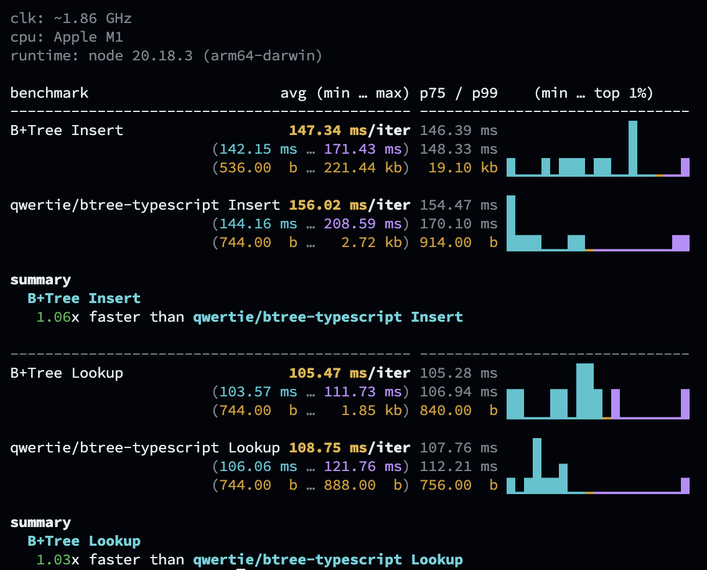

# A Fast B+Tree implementation in TypeScript

B+Tree implemented in TypeScript.

## Usage

```ts
import { BPTree } from "./bptree.js";
const tree = new BPTree();

// Insert some values
tree.insert(1, 10);
tree.insert(2, 20);

// Lookup a value
const value = tree.lookup(1);
console.log(value); // 10
```

## Early Benchmark

This is an early benchmark run using [`mitata`](https://github.com/evanwashere/mitata) that compares this implementation with other B+Tree implementations. The benchmark is not exhaustive and will be updated in the future.

